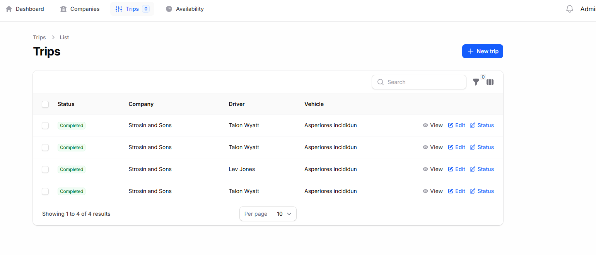
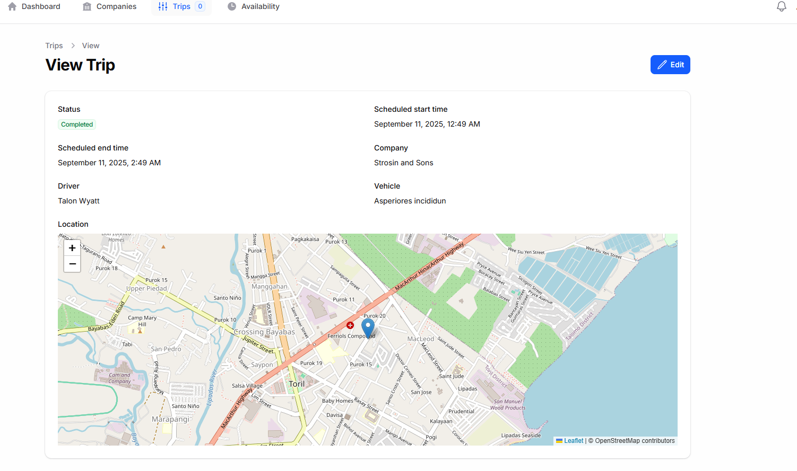

# Project Setup Instructions

Follow these steps in your terminal to get the application running.

---

### 1. Install Dependencies

This command installs all the required PHP packages defined in your `composer.json` file.

```bash
composer install
```

### 2. Set Up the Database

This command will drop all existing tables, re-run all migrations to create a fresh database schema, and then run the seeders to populate the database with initial data.

```bash
php artisan migrate:fresh --seed
```

### 3. Start the Development Server

This command starts the local PHP development server, typically making the application available at `http://127.0.0.1:8000`.

```bash
php artisan serve
```

### 4. Run the Queue Worker

This is essential for processing background jobs, such as sending real-time notifications for new trips. This command must be kept running in a separate terminal window.

```bash
php artisan queue:listen
```

---

## Key Design Decisions

### 1. Overlapping Trip Validation

To prevent double-booking of drivers and vehicles, a dedicated custom validation rule (App\Rules\DoesNotOverlap) was implemented.

##### Key Rationale:

-   Reusable & Consistent: This approach ensures the same validation logic is applied everywhere a trip can be scheduled.

-   Separation of Concerns: It keeps critical business logic separate from the user interface code, making the application easier to maintain.

-   Real-time Feedback: It integrates with Filament's forms to provide immediate validation to the user, improving their experience.

The rule works by checking for any active trips (scheduled or in_progress) that have a time conflict with a new or updated trip.

### 2. Query Performance Optimization

To ensure the application remains fast as data grows, two main strategies were used:

-   ager Loading: The "N+1 query problem" was solved by using Laravel Eloquent's with() method in all resources and pages. This loads all necessary related data (like driver and vehicle names) in a minimal number of queries, making tables and lists load much faster.

-   Efficient Date Filtering: For dashboard KPIs, slow date functions like whereMonth() were replaced with the much faster whereBetween() clause. This allows the database to use indexes to find records almost instantly, avoiding slow table scans.

### 3. User Roles & Permissions

The application has two distinct user roles, each with specific capabilities.

#### Admin Role

Admins have full control over the system and are responsible for managing the core data.

##### Default Login:

-   Email: admin@admin.com
-   Password: password

##### Permissions:

-   Manage Companies: Can create, view, update, and delete transportation companies.
-   Manage Drivers: Can add new drivers and assign them to a specific company.
-   Manage Vehicles: Can add new vehicles and assign them to a specific company.
-   Manage Trips: Has full CRUD (Create, Read, Update, Delete) access to all trips for all companies. This includes assigning drivers and vehicles to new trips.

#### Driver Role

Drivers have a more focused view, limited to their own assignments and information.

##### Default Login:

-   Email: will be based on the created driver email in the company
-   Password: password

##### Permissions:

-   View Assigned Trips: Can see a list or map view of all trips (scheduled, in_progress, completed) that have been specifically assigned to them.
-   Read-Only Access: This role generally has read-only access and cannot create or modify company data.

## Key Assumptions

Several assumptions were made to meet the project requirements, particularly where the acceptance criteria were high-level.

-   User Roles & Authentication: It was assumed that a standard Laravel authentication system was in place, with distinct "Admin" and "Driver" roles. This was crucial for implementing the different permissions and dashboard views required by the challenge.

-   Location Picker Implementation: The challenge implies selecting locations for trips, which requires a map interface.

    -   Custom Component: It was assumed that a custom form field component would be necessary. The implementation involved integrating a third-party JavaScript library (Leaflet.js) into a reusable Filament component.

    -   Data Structure: Location data (start_location and end_location) was assumed to be stored as a JSON column in the trips table. This is a flexible approach that allows for storing a structured object containing the human-readable address as well as the precise latitude and longitude.

    -   Geocoding Service: It was assumed that an external geocoding service (like Nominatim for OpenStreetMap) would be used to convert addresses into coordinates for routing and map display.

---

## Image Screenshots

### Admin

##### Dashboard


##### Company List


##### Create Company


##### Edit Company


##### View Company


##### Trips List



##### Create Trip


##### Edit Trip


##### View Trip



##### Custom Page


##### Custom Page Filter Data


### Driver

##### Dashboard


##### Assigned Trips


##### View Trip


